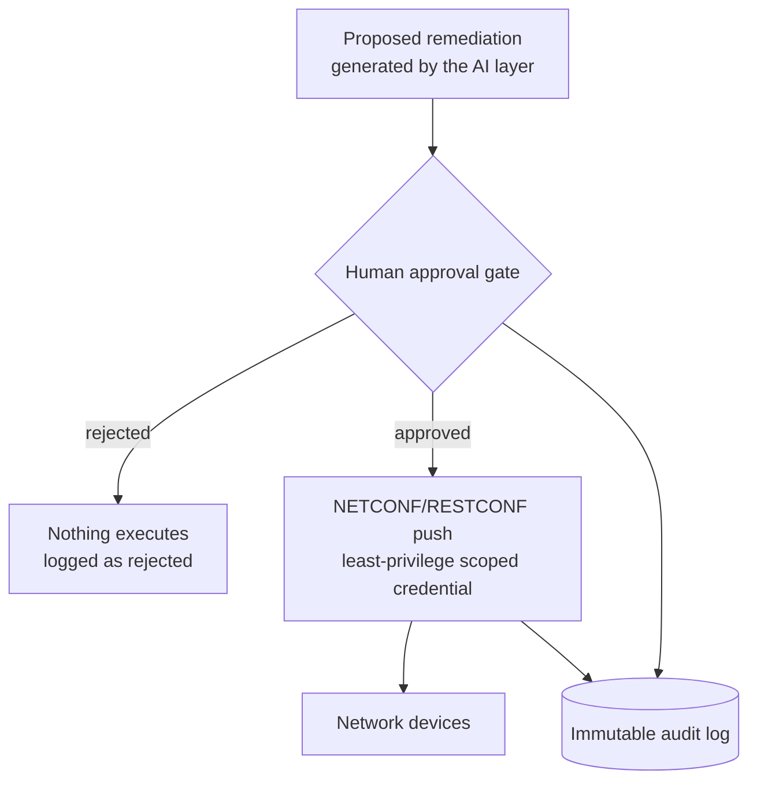

# NetMind AI — Architecture Overview

This document describes the intended architecture. It is written ahead of the code deliberately — the roadmap builds phase by phase (telemetry first, AI layer and security gate second), and this file gets corrected against reality as each phase lands. Treat anything below as a design intent, not a claim about what's implemented. A diagrammed, visual version of this document (with the mechanism drawn out box-by-box) is published separately — link it here once it has a permanent home; until then this file is the source of truth.

## System shape

```
┌────────────────   ┐      gNMI/gRPC       ┌──────────────┐
│  Network lab      │ ───────────────────▶ │Telemetry    │
│  (Containerlab +  │                      │  collector   │
│   Kubernetes/     │                      │              │
│   Cilium)         │                      └──────┬───────┘
└─────────▲─────────┘                             │
          │                                       ▼
          │                                 ┌──────────────┐
          │                                 │  Prometheus  │
          │                                 │  (+ Kafka    │
          │                                 │   buffer)    │
          │                                 └──────┬───────┘
          │                                        │
          │                                        ▼
          │                                 ┌──────────────┐
          │                                 │  Grafana     │
          │                                 │  dashboards  │
          │                                 └──────┬───────┘
          │                                        │
          │                                        ▼
          │                                 ┌──────────────┐
          │                                 │  Anomaly     │
          │                                 │  detection   │
          │                                 └──────┬───────┘
          │                                        │ on anomaly
          │                                        ▼
          │                                 ┌──────────────┐
          │                                 │  Diagnosis:   │
          │                                 │  retrieval    │
          │                                 │  over metrics/│
          │                                 │  logs/config  │
          │                                 │  history      │
          │                                 └──────┬───────┘
          │                                        │ proposed fix
          │                                        ▼
          │                                 ┌──────────────┐
          │                                 │  SECURITY     │
          │                                 │  GATE         │
          │                                 └──────┬───────┘
          │                approved                │
          └────────────────────────────────────────┘
                    NETCONF/RESTCONF config push
                    (least-privilege, scoped credential)
```

## The security gate — the design invariant everything else serves

This is the core architectural decision in NetMind AI, not a phase-2 add-on. No proposed remediation reaches the network without passing through it. Three controls, each addressing a specific risk:



1. **Least-privilege credential scoping** — the automation's NETCONF/RESTCONF credential is scoped to only the specific operations remediation needs, never full configuration access. Risk addressed: a compromised or malfunctioning AI component can't do more damage than the narrowest scope it was ever granted.
2. **Explicit human approval, no default-approve path** — every push requires an explicit decision, including changes that look low-risk. Risk addressed: an AI proposal that's subtly wrong in a way that looks plausible still gets a second, independent check before it's real.
3. **Immutable audit log** — every proposal, whether approved, rejected, or executed, is recorded in a log that can't be edited after the fact. Risk addressed: if something does go wrong, there's an exact record of what was proposed, who approved it, and what actually ran — not a reconstruction after the fact.

None of this requires the AI layer to be "trustworthy" in some abstract sense. It requires the system around it to make an untrustworthy proposal harmless by construction. That's the difference between a demo that reads a network and a system a network operator could actually be talked into deploying — and it's the part of this project that demonstrates architecture and security judgment specifically, not just AI integration skill.

## Two other systems live under "the AI layer"

**Anomaly detection** is statistics on numbers — a scheduled job comparing live telemetry against a rolling baseline (or a model like isolation forest once a fixed threshold proves insufficient). It never reads or writes a sentence.

**The diagnosis assistant** is retrieval-grounded: a question or an anomaly event triggers a vector search over indexed runbooks/past incidents in parallel with a structured query for the exact metrics/logs/config history for that time window. Both results are assembled into a prompt sent to a local LLM (via Ollama), which generates an answer — and the proposed remediation that then has to pass the security gate above. The citation isn't a model feature; it's bookkeeping already available for free, since the system knows exactly which retrieval results went into the prompt.

## Retrieval scope

Three sources feed the diagnosis step: recent Prometheus metric history (windowed, not full-resolution — the point is trend context, not raw dumps), structured event/log data if Kafka/Elasticsearch is in the pipeline, and the network's own configuration history — what changed, when, and what was pushed as a result of a prior remediation. Grounding diagnosis in the network's own configuration history, not just external documentation, is what separates this from a general-purpose RAG assistant pointed at a static knowledge base.

## Open questions (to resolve as phase 1/2 land)

- Anomaly detection: statistical baselining first (rolling mean/stddev, seasonal decomposition), escalate to a real model (isolation forest or similar) only once the baseline's limits are understood and articulable.
- Local LLM choice for the diagnosis/remediation-proposal layer: to be decided against actual hardware constraints once this phase starts — no API dependency, self-hosted via Ollama.
- Approval interface: starts as the simplest thing that enforces the gate (CLI y/n), not a build-a-UI detour before the loop itself works end to end.
- Audit log storage: append-only file vs. a small dedicated store — decide based on what's actually queryable later for the ADR write-up, not before there's real data to query.
