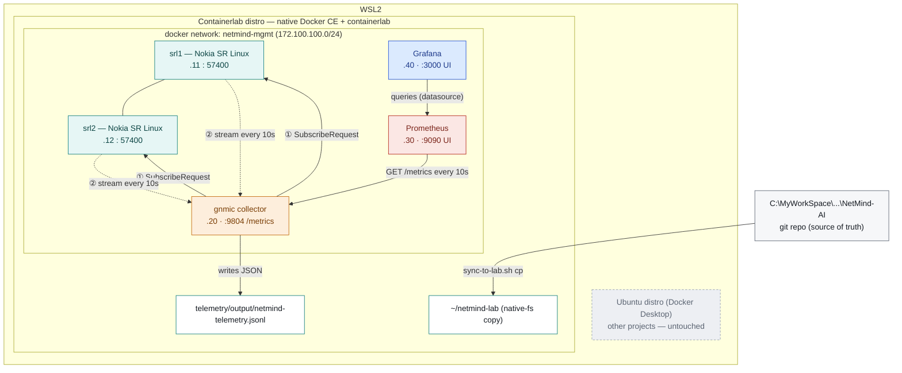

# NetMind AI — component diagram

Living diagram of how components connect, which platform each one runs on,
and how data moves between them. Update this file *and* the published
artifact below together as components #4–11 come online — don't let
either drift out of sync with `PROGRESS_LOG.md` (the decisions behind
any change here) or `docs/roadmap/BACKLOG.md` (anything deferred rather
than built).

**Rendered, colorful version (read this one):**
https://claude.ai/code/artifact/675b4713-1dec-4fee-adbd-d834242e1c26

The Mermaid source below is the git-tracked source of truth — edit it
here first, then have the rendered artifact republished to match.

**Status note:** Components #1–4 are all confirmed working as of
2026-09-10. Grafana (component #4) is provisioned as code (datasource
+ dashboard JSON auto-loaded, no manual UI setup) and its dashboard is
rendering live panels against real telemetry — see `PROGRESS_LOG.md`
entry (13). Direct scrape (no Kafka buffer) and default 15-day
retention were both deliberate choices, not oversights — see
`docs/roadmap/BACKLOG.md` items 1–2 for why and when to revisit.

## How the subscription actually works

gNMI's `Subscribe` RPC runs over a single long-lived gRPC connection, but
the two sides don't behave symmetrically. **gnmic is the client** — it
opens the connection to each target and sends **① one
`SubscribeRequest`**, naming the paths from
`telemetry/collectors/gnmic.yaml` (`/interface[name=*]/oper-state`,
`admin-state`, `statistics`) and the mode (`sample`, every 10s).

**srl1 and srl2 are the gNMI servers** — labeled "publisher / target" on
the diagram because, once that single request lands, each one **②
streams a continuous series of `SubscribeResponse`** messages back over
that same connection, unprompted, one batch per sample interval. gnmic
never asks again; it just keeps receiving.

That's why the first verification run kept producing data forever once
the pipe opened — it's a long-lived streaming pull, not gnmic polling on
a timer. gnmic then converts each response into a compact JSON event and
writes it to `output/netmind-telemetry.jsonl`, bind-mounted straight
through to the WSL shell rather than staying locked inside the
container — and, separately, exposes the same data as Prometheus-format
metrics on `:9804`. Prometheus's relationship to gnmic is the opposite
direction: **Prometheus is the client here** — it initiates a `GET
/metrics` request against gnmic every 10 seconds (a pull, not a push),
which is why the arrow points from Prometheus to gnmic rather than the
other way around.

**Grafana's relationship to Prometheus follows the same pull shape** —
Grafana is the client, querying Prometheus's HTTP API whenever a
dashboard panel needs data (on load, and every 10s while the dashboard
auto-refreshes). Nothing is pushed into Grafana; it's provisioned with
Prometheus as a datasource and pulls on demand.

## Component status

Extend this table as components #4–11 come online. Anything listed as
"planned" with no further detail has its full description in
`PROGRESS_LOG.md`'s Component map; anything deliberately simplified has
its reasoning in `docs/roadmap/BACKLOG.md`.

| Component | Runs on | Role | Address / port | Status |
|---|---|---|---|---|
| srl1 | Containerlab distro (Docker container) | gNMI target — network device under observation | 172.100.100.11 : 57400 | ✅ verified |
| srl2 | Containerlab distro (Docker container) | gNMI target — network device under observation | 172.100.100.12 : 57400 | ✅ verified |
| gnmic | Containerlab distro (Docker container) | gNMI collector — subscribes & writes telemetry + exposes Prometheus metrics | 172.100.100.20 · :9804 | ✅ verified (file + Prometheus output) |
| netmind-mgmt | Containerlab distro (Docker bridge network) | connectivity between all containers | 172.100.100.0/24 | ✅ verified |
| sync-to-lab.sh | Windows ↔ WSL2 boundary | copies the repo to native fs before every deploy | — | ✅ verified |
| Prometheus | Containerlab distro (Docker container) | metrics store — scrapes gnmic directly, no persistence yet | 172.100.100.30 · :9090 | ✅ verified |
| Grafana | Containerlab distro (Docker container) | dashboards on top of Prometheus, provisioned as code | 172.100.100.40 · :3000 | ✅ verified |
| k3s + Cilium | not yet built (same Containerlab distro) | K8s underlay, attaches to reserved `e1-2` | — | ⏳ planned · phase 2 |
