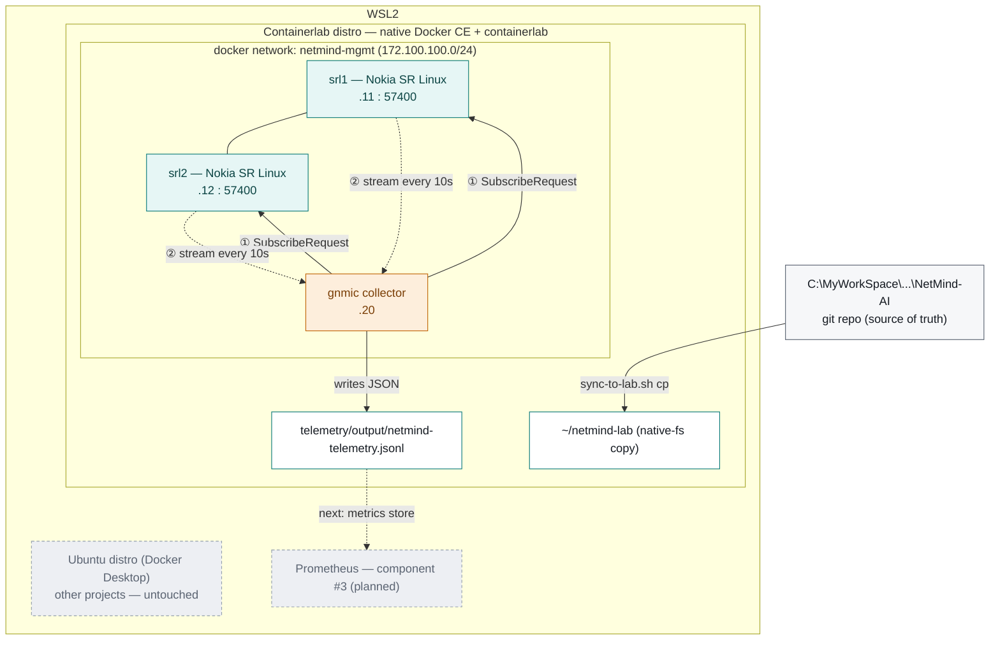

# NetMind AI — component diagram

Living diagram of how components connect, which platform each one runs on,
and how data moves between them. Update this file *and* the published
artifact below together as components #3–11 come online — don't let
either drift out of sync with `PROGRESS_LOG.md`, which is where the
decisions behind any change here get recorded.

**Rendered, colorful version (read this one):**
https://claude.ai/code/artifact/675b4713-1dec-4fee-adbd-d834242e1c26

The Mermaid source below is the git-tracked source of truth — edit it
here first, then have the rendered artifact republished to match.

## How the subscription actually works

gNMI's `Subscribe` RPC runs over a single long-lived gRPC connection, but
the two sides don't behave symmetrically. **gnmic is the client** — it
opens the connection to each target and sends **① one
`SubscribeRequest`**, naming the paths from
`telemetry/collectors/gnmic.yaml` (`/interface[name=*]/oper-state`,
`admin-state`, `statistics`) and the mode (`sample`, every 10s).

**srl1 and srl2 are the gNMI servers** — labeled "publisher / target" on
the diagram because, once that single request lands, each one **②
streams a continuous series of `SubscribeResponse`** messages back over
that same connection, unprompted, one batch per sample interval. gnmic
never asks again; it just keeps receiving.

That's why the first verification run kept producing data forever once
the pipe opened — it's a long-lived streaming pull, not gnmic polling on
a timer. gnmic then converts each response into a compact JSON event and
writes it to `output/netmind-telemetry.jsonl`, bind-mounted straight
through to the WSL shell rather than staying locked inside the
container.

## Component status

Extend this table as components #3–11 come online.

| Component | Runs on | Role | Address / port | Status |
|---|---|---|---|---|
| srl1 | Containerlab distro (Docker container) | gNMI target — network device under observation | 172.100.100.11 : 57400 | ✅ verified |
| srl2 | Containerlab distro (Docker container) | gNMI target — network device under observation | 172.100.100.12 : 57400 | ✅ verified |
| gnmic | Containerlab distro (Docker container) | gNMI collector — subscribes & writes telemetry | 172.100.100.20 | ✅ verified |
| netmind-mgmt | Containerlab distro (Docker bridge network) | connectivity between the three containers above | 172.100.100.0/24 | ✅ verified |
| sync-to-lab.sh | Windows ↔ WSL2 boundary | copies the repo to native fs before every deploy | — | ✅ verified |
| Prometheus | not yet built | metrics store — scrapes/ingests telemetry | — | ⏳ planned · #3 |
| Grafana | not yet built | dashboards on top of Prometheus | — | ⏳ planned · #4 |
| k3s + Cilium | not yet built (same Containerlab distro) | K8s underlay, attaches to reserved `e1-2` | — | ⏳ planned · phase 2 |
