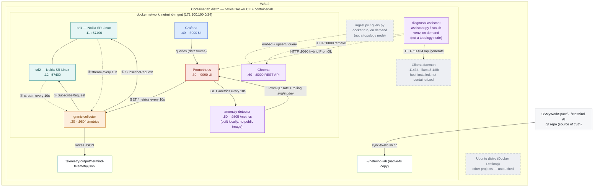

# NetMind AI — component diagram

Living diagram of how components connect, which platform each one runs on,
and how data moves between them. Update this file *and* the published
artifact below together as components #7–11 come online — don't let
either drift out of sync with `PROGRESS_LOG.md` (the decisions behind
any change here) or `docs/roadmap/BACKLOG.md` (anything deferred rather
than built).

**Rendered, colorful version (read this one):**
https://claude.ai/code/artifact/675b4713-1dec-4fee-adbd-d834242e1c26

The Mermaid source below is the git-tracked source of truth — edit it
here first, then have the rendered artifact republished to match.

**Status note:** Components #1–7 are all confirmed working as of
2026-09-13. Component #6 (retrieval index) is verified end to end:
`ingest.py` chunked and embedded this project's own docs into Chroma
(141 chunks from 12 documents), and `query.py` returned genuinely
relevant results for a real question — see `PROGRESS_LOG.md` entry
(17). Direct scrape (no Kafka buffer) and default 15-day retention
were both deliberate choices, not oversights — see
`docs/roadmap/BACKLOG.md` items 1–2 for why and when to revisit.

Component #7 (diagnosis assistant) is verified end to end as of
2026-09-13: `assistant.py`, called with a question that needs both a
live metric and a retrieved doc, returned a correctly cited answer
combining a real Prometheus number (via the hybrid template/LLM
PromQL router) and a real doc citation (via Chroma retrieval) — see
`PROGRESS_LOG.md` entries 26–28. Getting there also surfaced and fixed
a real bug: component #5's anomaly detector had been reading the wrong
Prometheus label key since it was built, mislabeling every interface
as `"unknown"` — fixed in both components, confirmed live. Ollama and
`diagnosis-assistant` both run host-installed rather than as topology
nodes (dashed lines above) — see `docs/setup/07-diagnosis-assistant.md`
for why.

## How the subscription actually works

gNMI's `Subscribe` RPC runs over a single long-lived gRPC connection, but
the two sides don't behave symmetrically. **gnmic is the client** — it
opens the connection to each target and sends **① one
`SubscribeRequest`**, naming the paths from
`telemetry/collectors/gnmic.yaml` (`/interface[name=*]/oper-state`,
`admin-state`, `statistics`) and the mode (`sample`, every 10s).

**srl1 and srl2 are the gNMI servers** — labeled "publisher / target" on
the diagram because, once that single request lands, each one **②
streams a continuous series of `SubscribeResponse`** messages back over
that same connection, unprompted, one batch per sample interval. gnmic
never asks again; it just keeps receiving.

That's why the first verification run kept producing data forever once
the pipe opened — it's a long-lived streaming pull, not gnmic polling on
a timer. gnmic then converts each response into a compact JSON event and
writes it to `output/netmind-telemetry.jsonl`, bind-mounted straight
through to the WSL shell rather than staying locked inside the
container — and, separately, exposes the same data as Prometheus-format
metrics on `:9804`. Prometheus's relationship to gnmic is the opposite
direction: **Prometheus is the client here** — it initiates a `GET
/metrics` request against gnmic every 10 seconds (a pull, not a push),
which is why the arrow points from Prometheus to gnmic rather than the
other way around.

**Grafana's relationship to Prometheus follows the same pull shape** —
Grafana is the client, querying Prometheus's HTTP API whenever a
dashboard panel needs data (on load, and every 10s while the dashboard
auto-refreshes). Nothing is pushed into Grafana; it's provisioned with
Prometheus as a datasource and pulls on demand.

**The anomaly detector has a relationship with Prometheus in *both*
directions**, unlike Grafana. As a client, it queries Prometheus's
PromQL API every `EVAL_INTERVAL_SECONDS` (default 30s) for the current
rate and the rolling `avg_over_time`/`stddev_over_time` baseline of
each watched counter, computing a z-score itself rather than asking
Prometheus for one directly. As a server, it exposes that z-score back
on its own `:9805/metrics` endpoint, which Prometheus then scrapes on
its normal 10s cycle — the same shape as gnmic, just one hop further
downstream. See `intelligence/anomaly-detection/README.md` for why a
standalone service was chosen over a Prometheus recording rule.

**Chroma breaks the pull-only pattern entirely** — nothing scrapes it
and it scrapes nothing. `ingest.py` and `query.py` are plain HTTP
clients that connect to Chroma's REST API on demand (`docker run`
against the `netmind-mgmt` network, dashed on the diagram because
they're not a standing topology node), embed text locally with
Chroma's default ONNX embedding function, and either upsert or query
vectors. There's no Prometheus/Grafana involvement at all yet for this
component — it's a separate axis (semantic search over docs) from the
telemetry axis every other component so far has extended.

## Component status

Extend this table as components #7–11 come online. Anything listed as
"planned" with no further detail has its full description in
`PROGRESS_LOG.md`'s Component map; anything deliberately simplified has
its reasoning in `docs/roadmap/BACKLOG.md`.

| Component | Runs on | Role | Address / port | Status |
|---|---|---|---|---|
| srl1 | Containerlab distro (Docker container) | gNMI target — network device under observation | 172.100.100.11 : 57400 | ✅ verified |
| srl2 | Containerlab distro (Docker container) | gNMI target — network device under observation | 172.100.100.12 : 57400 | ✅ verified |
| gnmic | Containerlab distro (Docker container) | gNMI collector — subscribes & writes telemetry + exposes Prometheus metrics | 172.100.100.20 · :9804 | ✅ verified (file + Prometheus output) |
| netmind-mgmt | Containerlab distro (Docker bridge network) | connectivity between all containers | 172.100.100.0/24 | ✅ verified |
| sync-to-lab.sh | Windows ↔ WSL2 boundary | copies the repo to native fs before every deploy | — | ✅ verified |
| Prometheus | Containerlab distro (Docker container) | metrics store — scrapes gnmic directly, no persistence yet | 172.100.100.30 · :9090 | ✅ verified |
| Grafana | Containerlab distro (Docker container) | dashboards on top of Prometheus, provisioned as code | 172.100.100.40 · :3000 | ✅ verified |
| anomaly-detector | Containerlab distro (Docker container, built locally) | rolling z-score anomaly detection on interface counters, no ML/LLM yet | 172.100.100.50 · :9805 | ✅ verified |
| Chroma | Containerlab distro (Docker container) | vector store for this project's own docs, no persistence yet | 172.100.100.60 · :8000 | ✅ verified |
| ingest.py / query.py | Containerlab distro (docker run, on demand — built locally) | chunk+embed docs into Chroma / prove retrieval works | — | ✅ verified |
| Ollama | Containerlab distro (host-installed, not containerized) | local LLM daemon — serves Llama 3.1 8B, `keep_alive:0` per request | localhost:11434 | ✅ verified |
| diagnosis-assistant | Containerlab distro (host-level venv, on demand — built locally) | hybrid PromQL + retrieval-grounded LLM answers, cited | — | ✅ verified |
| k3s + Cilium | Containerlab distro (k3s host-installed; Cilium as CNI) | K8s cluster; real workload proven (`k8s/proof-app/`); BGP-peers with `srl1` over reserved `e1-2` (ASN 65002 ↔ 65001), Pod CIDR `10.0.0.0/24` advertised and validly installed | 192.168.99.1 (e1-2 underlay) | ✅ verified (BACKLOG.md item 4, log 62–64) |
